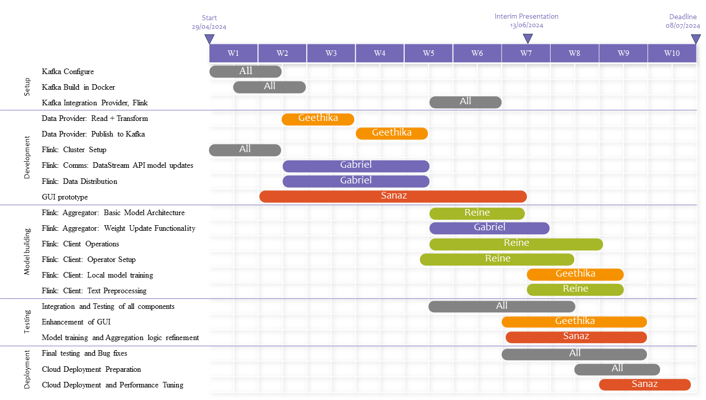

# BD24_Project_A4_A - Federated Sentiment Analysis

Project for Big Data Course at TUHH.

## Table of Contents

- [Gantt Diagram](#gantt-diagram)
- [Docker](#docker)

## Gantt Diagram


## Docker (for local setup)

Use `docker-compose.yml` from GitHub. Go to the location where `docker-compose.yml` is there on cmd.

Execute commands:

```cmd
# For Kafka
docker-compose up -d

# Create a topic
docker exec -it kafka kafka-topics.sh --create --topic test --partitions 1 --replication-factor 1 --bootstrap-server localhost:9092

# Produce messages to the topic
docker exec -it kafka bash -c "echo 'Hello, Kafka!' | kafka-console-producer.sh --topic test --bootstrap-server localhost:9092"

# Consume messages from the topic
docker exec -it kafka kafka-console-consumer.sh --topic test --from-beginning --bootstrap-server localhost:9092
```

[For Flink on Windows Comands Source](https://nightlies.apache.org/flink/flink-docs-master/docs/deployment/resource-providers/standalone/docker/)

```console
# For Flink
set FLINK_PROPERTIES=jobmanager.rpc.address:jobmanager

# Create a Network
docker network create flink-network

# Launch Job Manager
docker run --rm --name=jobmanager --network flink-network --publish 8081:8081 --env FLINK_PROPERTIES="%FLINK_PROPERTIES%" flink:latest jobmanager

# Launch one or more TaskManager containers
docker run --rm --name=taskmanager --network flink-network --env FLINK_PROPERTIES="%FLINK_PROPERTIES%" flink:latest taskmanager

# Stop / shut down cluster
docker stop jobmanager taskmanager
```
[For Flink on Ubuntu Comands Source (local)](https://nightlies.apache.org/flink/flink-docs-master/docs/deployment/resource-providers/standalone/docker/)

```console
# For Flink
FLINK_PROPERTIES=jobmanager.rpc.address:jobmanager

# Create a Network
sudo docker network create flink-network

# Launch Job Manager
sudo docker run --rm --name=jobmanager --network flink-network --publish 8081:8081 --env FLINK_PROPERTIES="jobmanager.rpc.address:jobmanager" flink:latest jobmanager

# Launch one or more TaskManager containers
sudo docker run --rm --name=taskmanager --network flink-network --env FLINK_PROPERTIES="$FLINK_PROPERTIES" flink:latest taskmanager

# Stop / shut down cluster
sudo docker stop jobmanager taskmanager
```
# Building Custom Python-Flink (Client) Docker-Image
```console
cd flink && sudo docker build -t ml_client_taskmanager:latest .
```
# Using Custom Docker-Image as Taskmanager in flink (ubuntu)
```console
FLINK_PROPERTIES=jobmanager.rpc.address:jobmanager
sudo docker run --rm --name=jobmanager --network flink-network --publish 8081:8081 --env FLINK_PROPERTIES="jobmanager.rpc.address: jobmanager" ml_client_taskmanager jobmanager

# consider the second to last argument; it is the image name we specified in Custom Python-Flink build process.
sudo docker run --rm --name=custom_mlclient1 --network flink-network --env FLINK_PROPERTIES="jobmanager.rpc.address: jobmanager" ml_client_taskmanager taskmanager
sudo docker run --rm --name=datasplitter --network flink-network --env FLINK_PROPERTIES="jobmanager.rpc.address: jobmanager" ml_client_taskmanager taskmanager
```
You can see Flink Dashboard at [localhost:8081](http://localhost:8081)

```cmd
# Stop / shut down docker
docker-compose down
```
Great command to get rid of dangling images after re-building an image.
```cmd

sudo docker build . --tag data-provider:latest && sudo docker rmi -f $(sudo docker images -f "dangling=true" -q) && sudo docker run --rm -v /home/gabst/projects/big_data/data/:/data data-provider
sudo docker build . --tag data-provider:latest && sudo docker run --rm -v /home/gabst/projects/big_data/data:/data data-provider:latest


```